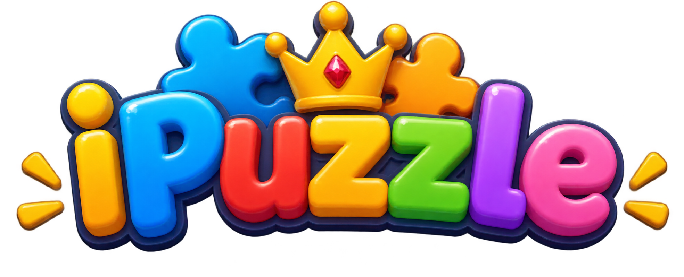

# iPuzzle

<p align="center">
  
</p>

<h3 align="center">
Обучающая Android-игра для детей дошкольного возраста
</h3>

<p align="center">
Собирай пазлы, отвечай на вопросы и изучай компьютерную технику!
</p>


---

## О проекте

**iPuzzle** — это небольшая обучающая Android-игра, созданная для детей дошкольного возраста, направленная на проверку знаний о компьютерных внешних и внутренних устройств.

Игрок выбирает уровень сложности: лёгкий - 10 уровней, средний - 15 уровней, сложный - 20 уровней

---

# Уровни

В игре используются уровни, посвящённые компьютерной технике и периферии.

| №  | Устройство |
|----|------------|
| 1  | Монитор    |
| 2  | Клавиатура |
| 3  | Мышь       |
| 4  | Камера     |
| 5  | Микрофон   |
| 6  | Наушники   |
| 7  | Принтер    |
| 8  | Колонки    |
| 9  | Флешка     |
| 10 | Ноутбук    |
| 11 | Сканер     |
| 12 | Роутер     |
| 13 | Телефон    |
| 14 | Планшет    |
| 15 | Веб-камера |
| 16 | Джойстик   |
| 17 | Проектор   |
| 18 | Видеокарта |
| 19 | Процессор  |
| 20 | Повербанк  |


P.S их порядок рандомный при каждом запуске

P.P.S возможно скоро будет обновлено

---

# Техническая часть

iPuzzle разработан на **Java** с использованием стандартного Android SDK


---

# Основные классы

| Класс            | Назначение                                |
|------------------|-------------------------------------------|
| `SoundManager`   | Запуск фоновой и другой музыки            |
| `MainActivity`   | Главное меню, выбор сложности             |
| `PuzzleActivity` | Управление игрой, вопросами, результатами |
| `PuzzleView`     | Отрисовка пазла, обработка касаний        |
| `LevelManager`   | Создание, рандомизация уровней            |
| `Level`          | Данные уровня                             |
| `Question`       | Вопросы, варианты ответов                 |
| `ResultActivity` | Итоги                                     |

---

# Запуск проекта

## Требования

- Android Studio
- JDK
- Android SDK
- Android 6.0 (API 24) или выше


## Клонирование

```bash
git clone https://github.com/kuzia15/iPuzzle.git